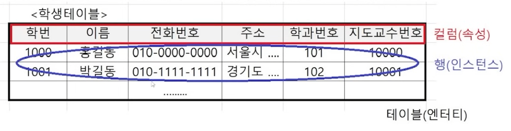
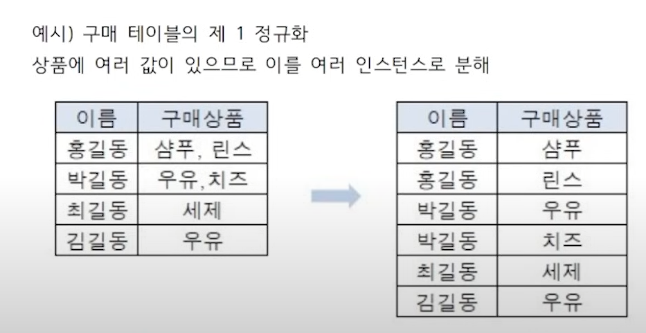
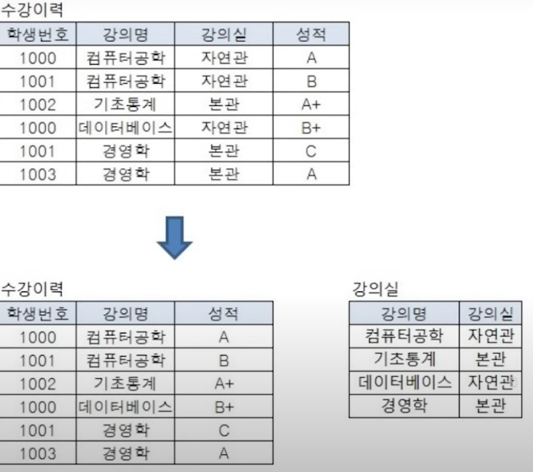
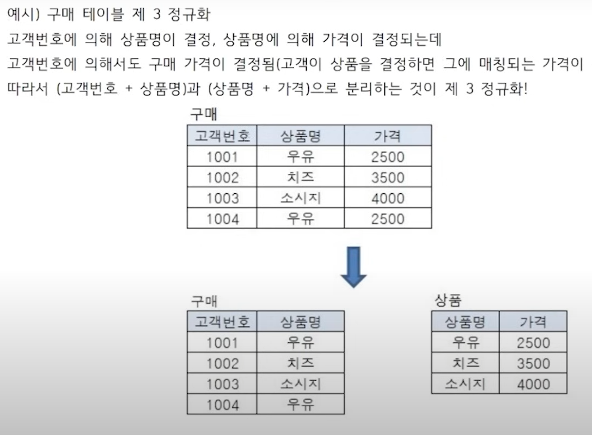
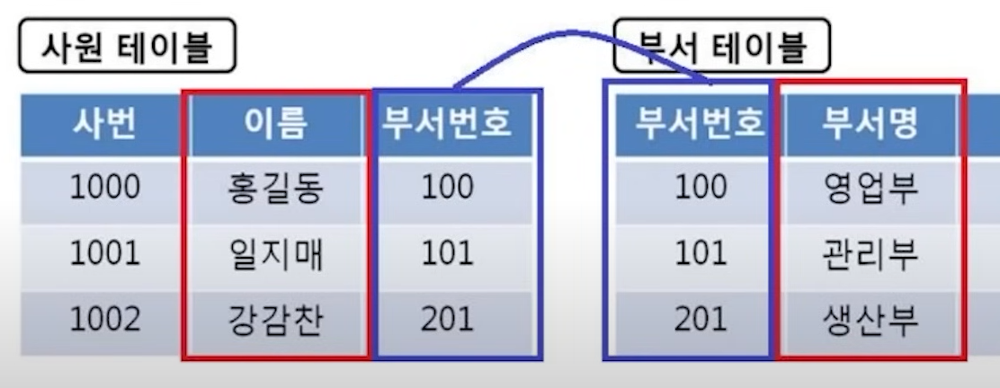
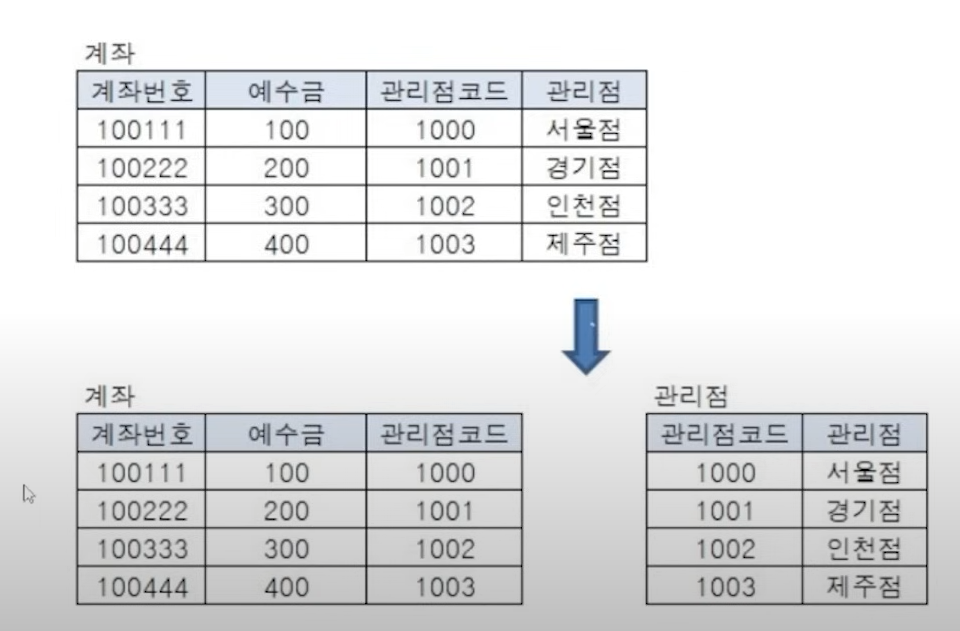
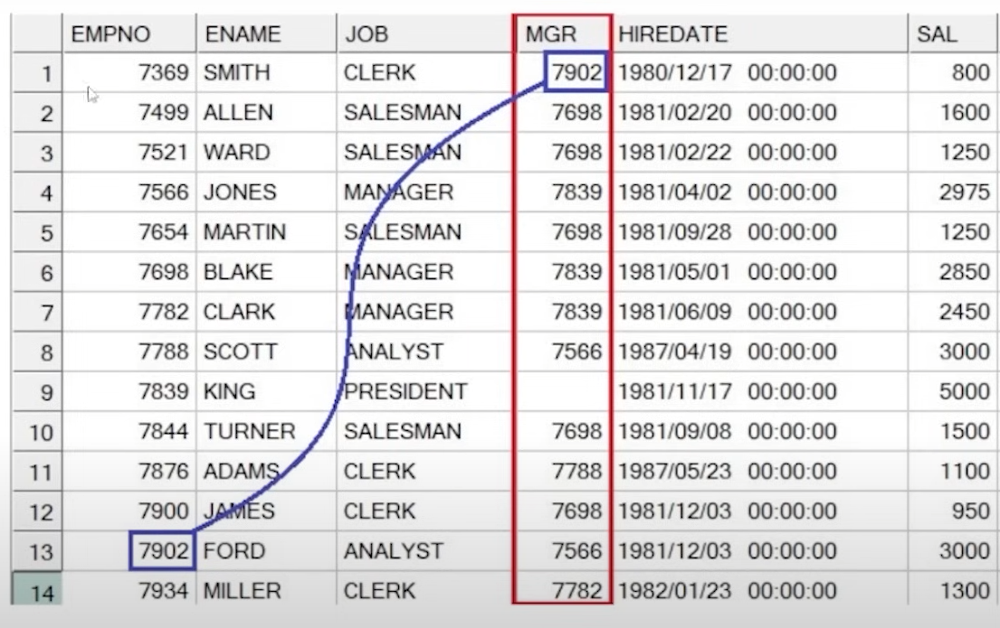
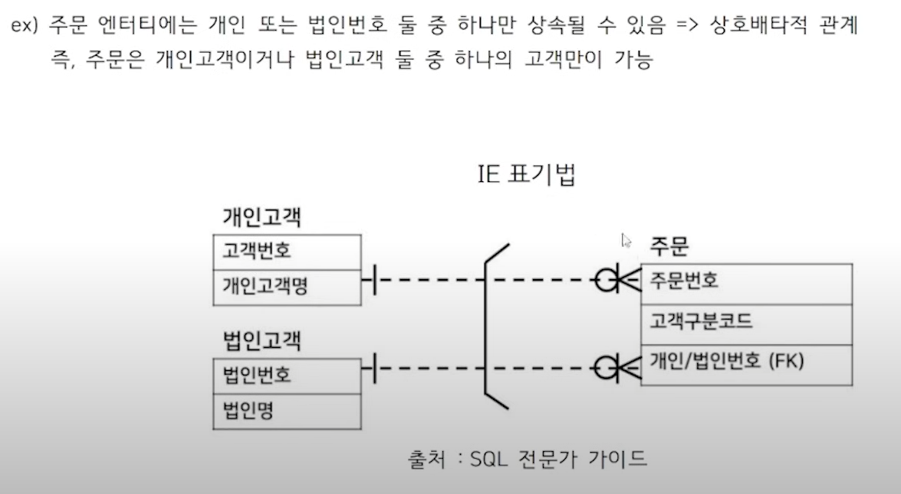

출처 : https://www.youtube.com/watch?v=QB_GYdHUHmA&t=2716s

간단한 개념은 넘어가고 정리하겠습니다.
#### 태아블의 기본 구조

### 데이터 모델링 3가지 요소
- 대상 : 업무가 관리하고자 하는 대상(객체)
- 속성 : 대상들이갖는 속성(하나의 특징으로 정의될 수 있는 것)
- 관계 : 대상들 간의 관계

### 데이터 모델링의 3단계
1. 개념적 모델링 : 이런게 필요하겠다 정도
2. 논리적 모델링 : 세부속성, 식별자, 관계 등을 정의, 데이터 정규화 수행(테이블의 구성요소 정의)
3. 물리적 모델링 : 논리 모델링을 물리적으로 생성

### ERD 작성 절차(6단계)
1. 엔티티를 도출한 후 그린다.
2. 엔티티 배치
3. 엔티티 간의 관계 설정
4. 관계명을 서술
5. 관계의ㅣ 참여도 기술
6. 관계의 필수 여부를 확인

## 정규화
- 하나에 엔티티에 많은 속성을 넣게 되면, 해당 엔티티를 조회할 때 마다 많은 양의 데이터가 조회될 것이므로 최소한의 데이터만을 하나의 엔티티에 넣는 식으로 데이터를 분해하는 과정
- 데이터의 중복을 제거하고 데이터 모델의 독립성을 확보
- 데이터 이상현상을 줄이기 위한 데이터 베이스 설계 기법
- 엔티티를 상세화하는 과정으로 논리 데이터 모델링  수행 시점에서 고려됨

### 이상 현상
- 정규화를 하지 않아 발생하는 현상(삽입이상, 갱신이상, 삭제이상)

### 정규화 단계

#### 제 1 정규화
- 테이블의 컬럼이 원자성을 갖도록 테이블을 분해

#### 제 2 정규화
- 제 1 정규화를 진행한 테이블에 대해 **완전 함수 종속**을 만들도록 테이블 분해
- 완전 함수 종속이란, 기본키를 구성하는 모든 컬럼의 값이 다른 컬럼을 결정짓는 상태 -> PK가 모든 컬럼의 결정자
- PK가 2개 이상일 때 발생하며 PK의 일부와 종속되는 관계가 있다면  분리

#### 제 3 정규화
- 제 2 정규화를 진행한 테이블에 대해 이행적 종속을 없애도록 테이블을 분리
- 이행적 종속이란 A -> B, B -> C의 관계가 성립할 때, A -> C가 성립되는 것을 말함
- (A,B)와 (B,C)로 분리하는 것이 제 3 정규화(대체적으로 A는 PK)

### 관계의 개념
- 엔티티의 인스턴스 사이의 논리적인 연관성
- 엔티티의 정의, 속성 정의 및 관계 정의에 따라서도 다양하게 변할 수 있음
- 관게를 맺는다는 의미는 부모의 식별자를 자식에 상속하고, 상속된 속성을 매핑키(조인키)로 활용
    -> 부모, 자식을 연결함

### 조인의 의미
- 결국 데이터의 중복을 피하기 위해 테이블은 정규화에 의해 분리된다. 분리되면서 두 테이블은 서로 관게를 맺게 되고, 다시 이 두 테이블의 데이터를 동시에 출력하거나 관계가 있는 테이블을 참조하기 위해서는 데이터를 연결해야 하는데 이 과정을 조인이라고 함

### 계층형 데이터 모델
- 자기 자신끼리 관계가 발생, 즉 하나의 엔티티 내의 인스턴스끼리 계층 구조를 가지는 경우를 말함
- 계층 구조를 갖는 인스턴스끼리 연결하는 조인을 셀프조인이라함(같은 테이블을 여러 번 조인)

### 상호배타적 관게
- 두 테이블 중 하나만 가능한 관계를 말함

### 식별자 구분

1. 본질 식별자
- 업무에 필요한 식별자
2. 인조 식별자
- 업무에 필요하진 않지만 편리상 만들어진 식별자