출처 : https://www.youtube.com/watch?v=_f_WZYuNr7A&t=35s

### 관계형 데이터베이스 구성 요소
- 계정 : 데이터의 접근 제한을 위한 여러 업무별/시스템별 계정이 존재
- 테이블 : DBMS의 DB 안에서 데이터가 저장되는 형식
- 스키마 : 테이블이 어떠한 구성으로 되어있는지, 어떠한 정보를 가지고 있는지에 대한 기본적인 구조를 정의

#### 테이블
1. 정의
   - 엑셀에서의 워크시트처럼 행과 열을 갖는 2차원 구조로 구성, 데이터를 입력하여 저장하는 최소 단위
   - 컬럼은 속성이라고도 부름(모델링 단계마다 부르는 용어가 다름)
2. 특징
   - 하나의 테이블은 반드시 하나의 유저(계정) 소유여야 함
   - 테이블간 관게는 일대일, 일대다, 다대다 관계를 가질 수 있음
   - 태이블명은 중복될 수 없지만, 소유자가 다른 경우 같은 이름으로 생성 가능
   - 테이블은 행 단위로 데이터가 입력, 삭제되며 수정은 값의 단위로 가능

    
### SQL
- 관계형 데이터베이스에서 데이터 조회 및 조작, DBMS 시스템 관리 기능을 명령하는  언어
- 데이터의 정의(DDL), 데이터 조작(DML), 데이터 제어 언어(DCL) 등으로 구분
- SQL 문법은 대, 소문자를 구분하지 않음

### 관계형 데이터베이스 특징
- 데이터의 분류, 정렬, 탐색 속도가 빠름
- 신뢰성이 높고, 데이터의 무결성 보장
- 기존의 작성된 스키마를 수정하기 어려움
- 데이터베이스의 부하를 분석하는 것이 어려움

### 데이터 무결성
- 데이터의 정확성과 일관성을 유지하고, 데이터에 결손과 부정합이 없음을 보증하는 것
- 데이터베이스에 저장된 값과 그것이 표현하는 현실의 비즈니스 모델의 값이 일치하는 정확성을 의미함
- 데이터 무결성을 유지하는 것이 데이터베이스 관리시스템에 중요한 기능

### 데이터 무결성 종류
- 개체 무결성 : 테이블의 기본키를 구성하는 컬럼 NULL 값이나 중복값을 가질 수 없음
- 참조 무결성 : 외래키 값은 NULL이거나 참조 테이블의 기본키 값과 동일해야 한다.(외래키란 참조 테이블의 기본키에 정의된 데이터만 허용되는 구조이므로)
- 도메인 무결성 : 주어진 속성 값이 정의된 도메인에 속한 값 이어야 함
- NULL 무결성 : 특정 속성에 대해 NULL을 허용하지 않는 특징
- 고유 무결성 : 특정 속성에 대해, 값이 중복되지 않는 특징
- 키 무결성 : 하나의 릴레이션(관계)에는 적어도 하나의 키가 존재해야 함(테이블이 서로 관계를 가질 경우 반드시 하나 이상의 조인키를 가짐)

도메인 : 각 컬림(속성)이 갖는 범위

릴레이션 : 테이블간 관계를 말함

튜플 : 하나의 행을 의미함

키 : 식별자

### ERD(Entity Relationship Diagram)
- ERD란 테이블 간 서로의 상관 관게를 그림으로 표현한 것
- ERD의 구성요소에는 엔티티, 관계, 속성이 있다.

    -> 현실 세계의 데이터는 이 3가지의 구성으로 모두 표현 가능

### SQL 종류
- SQL은 그 기능에 따라 다음과 같이 구분함
- DDL(Data Definition Language) : CREATE, ALTER, DROP, TRUNCATE
- DML(Data Manipulation Language) : INSERT, DELETE, UPDATE, MAERGE
- DCL(Data Contrl Language) : GRANT, REVOKE
- TCL(Transaction Control Language) : COMMIT, ROLLBACK
- DQL(Data Query Language) : SELECT

SELECT 문은 따로 SQL 종류 중 어디에도 속하지 않아서 SELECT 문을 위한 DQL 등장

### SELECT 문 구조
- SELECT 문은 다음과 같이 6개 절로 구성
- 각 절의 순서대로 작성해야 함
- SELECT 문의 내부 파싱(문법적 해석) 순서는 나열된 순서와는 다름
- FROM > WHERE > GROUP BY > HAVING > SELECT . ORDER BY 순서대로 실행됨
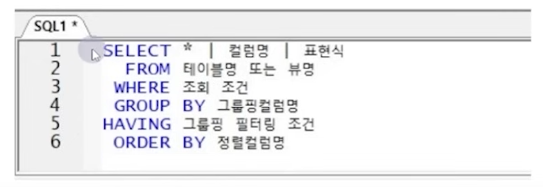

### SELECT 절
- SELECT 문장을 사용하여 불러올 컬럼명, 연산 결과를 작성하는 절
- *를 사용하여 테이블 내 전체 컬럼명을 불러올 수 있음
- 원하는 컬럼을 ,로 나열하여 작성 가능(순서대로 출력됨)
- 표현식이란 원래의 컬럼명을 제외한 모든 표현 가능한 대상(연산식, 기존 컬럼의 함수 변형식 포함)
#### 문법
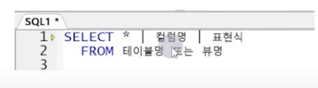

#### 특징
- SELECT 절에서 표시할 대상 컬럼에 Alias(별칭) 지정 가능(이름을 바꿔서 출력 가능)
- 대소문자를 구분하지 않아도 인식한다.

 ### 컬럼 Alias(별칭)
- 컬럼명 대신 출력할 임시 이름 지정(SELECT 절에서만 정의 가능, 원본 컬럼명은 변경되지 X)
- 컬렴명 뒤에 AS와 함께 컬럼 별칭 전달(AS는 생략 가능)

#### 특징 및 주의사항
- SELECT 문보다 늦게 수행되는 ORDER BY 절에서만 컬럼 별칭 사용 가능(그 외 절에서 사용시 에러 발생)
- 한글 사용 가능(한글 지원 캐릭터셋 설정 시)
- 이미 존재하는 예약어는 별칭으로 사용 불가(avg, decode, SELCET, FROM 등)
- 다음의 경우 별칭에 반드시 쌍따옴표 전달 필요
  - 별칭에 공백을 포함하는 경우
  - 별칭에 특수문자를 포함하는 경우("_" 제외)
  - 별칭 그대로 전달할 경우(입력한 대소를 그대로 출력하고자 할 때)

### FROM 절
- 데이터를 불러올 테이블명 또는 뷰명 전달
- 테이블 여러 개 전달 가능(컴마로 구분) -> 조인 조건 없이 테이블명만 나열 시 카티시안 곱 발생 주의!
- 테이블 별칭 선언 가능(AS 쓰지 않음)
  - 테이블 별칭 선언 시 컬럼 구분자는 테이블 별칭으로만 전달(테이블명으로 사용 시 에러 발생)
- ORACLE에서는 FROM절 생략 불가(의미상 필요 없는 경우 DUAL 테이블 선언, ORACLE 23c 버전부터는 생략 가능)
- MSSQL 에서는 FROM절이 필요 없을 경우 생략 가능(오늘 날짜 조회 시)

뷰 : 테이블과 동일하게 데이터를 조회할 수 있는 개체이지만 테이블처럼 실제 데이터가 저장된 것이 아닌, SELECT 문 결과에 이름을 붙여 그 이름만으로 조회가 가능하도록 한 기능

## 함수
### 함수 정의
- input value가 있을 경우 그에 맞는 output value를 출력해주는 객체
- input value와 output value의 관계를 정의한 객체
- from절을 제외한 모든 절에서 사용 가능

### 함수 기능
- 기본적인 쿼리문을 더욱 강력하게 해줌
- 데이터의 계산을 수행
- 개별 데이터의 항목을 수정
- 표시할 날짜 및 숫자 형식을 지정
- 열 데이터의 유형(data type)을 변환

### 함수의 종류
- 단일행 함수와 복수행 함수로 구분
- 단일행 함수 : input과 output의 관계가 1:1
- 복수행 함수 : 여러 건의 데이터를 동시에 입력 받아서 하나의 요약값을 리턴(그룹함수 또는 집계함수라고도 함)

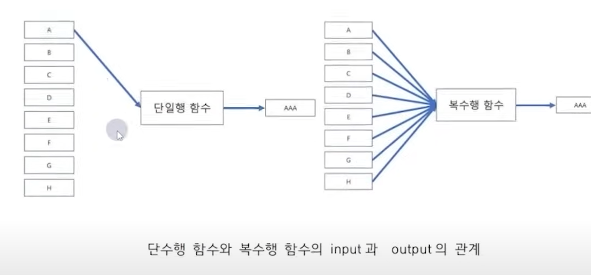

### 입/출력 값의 타입에 따른 함수 분류
#### 문자형 함수
- 문자열 결합, 추출, 삭제 등을 수행
- 단일행 함수 형태
- output은 대부분 문자값
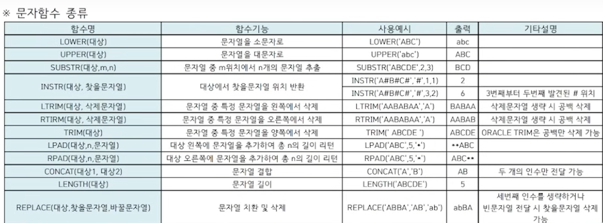

#### 숫자형 함수
- 숫자를 입력하면 숫자 값을 반환
- 단일행 함수 형태의 숫자함수
- oracle과 sql-Server 함수 거의 동일
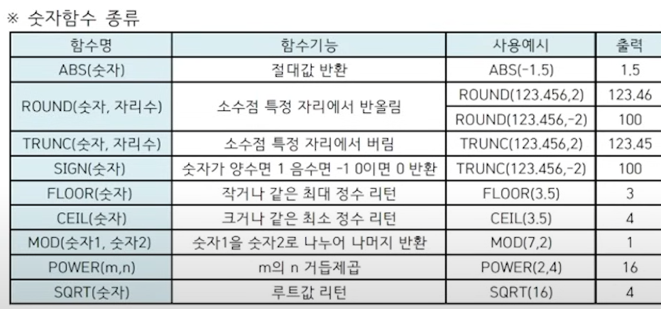

#### 날짜형 함수
- 날짜 연산과 관련된 함수
- oracle과 sql-Server 함수가 거의 다름
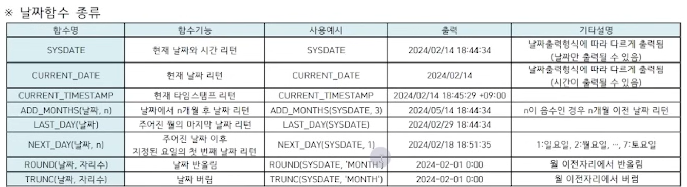

#### 변환함수
- 값의 데이터 타입을 변환
- 문자를 숫자로, 숫자를 문자로, 날짜를 문자로 변경
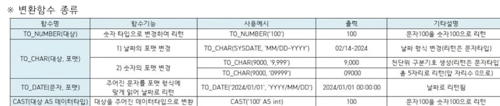

#### 그룹함수
- 다중행 함수
- 여러 값이 input값으로 들어가서 하나의 요약된 값으로 리턴
- group by와 함께 자주 사용됨
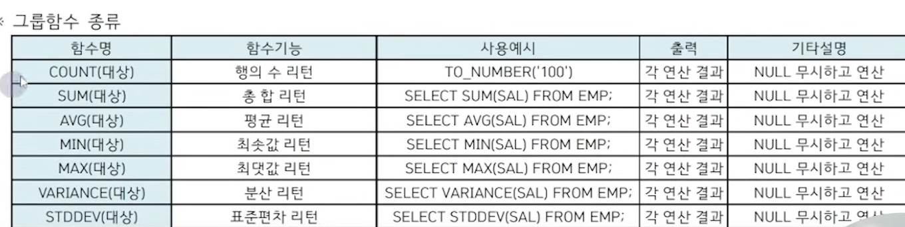

#### 일반함수
- 기타 함수(널 치환 함수 등)
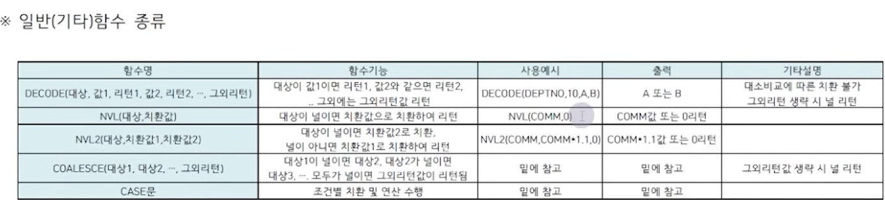
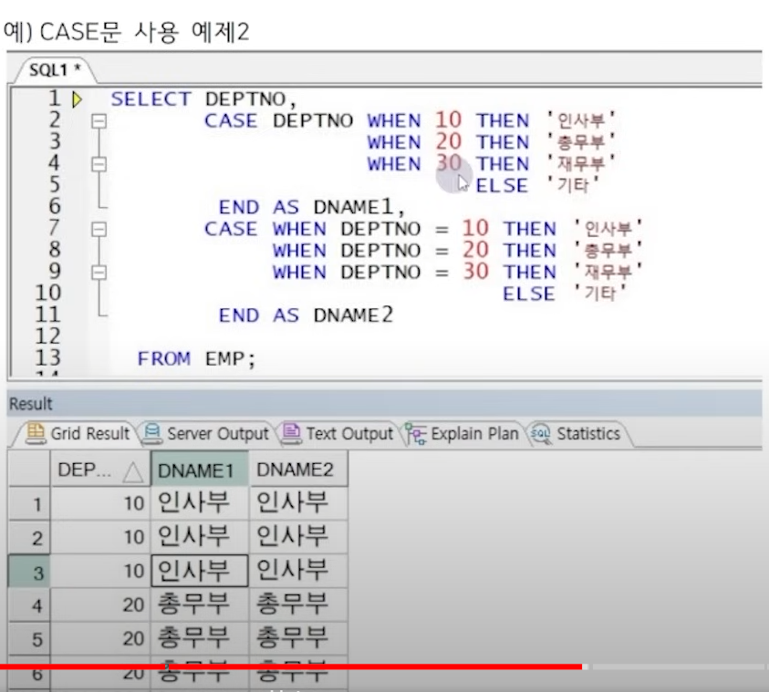

#### WHERE 절
- 테이블의 데이터 중 원하는 조건에 맞는 데이터만 조회하고 싶을 경우 사용
- 여러 조건 동시 전달 가능(AND와 OR로 조건 연결)
- NULL 조회 시 IS NULL / IS NOT NULL 연산자 사용(=연산자로 조회 불가)
- 연산자를 사용하여 다양한 표현이 가능
- 조건 전달 시 비교 대상의 데이터 타입 일치하는 것이 좋음 -> 불일치하면 성능 문제 발생할 수 있음

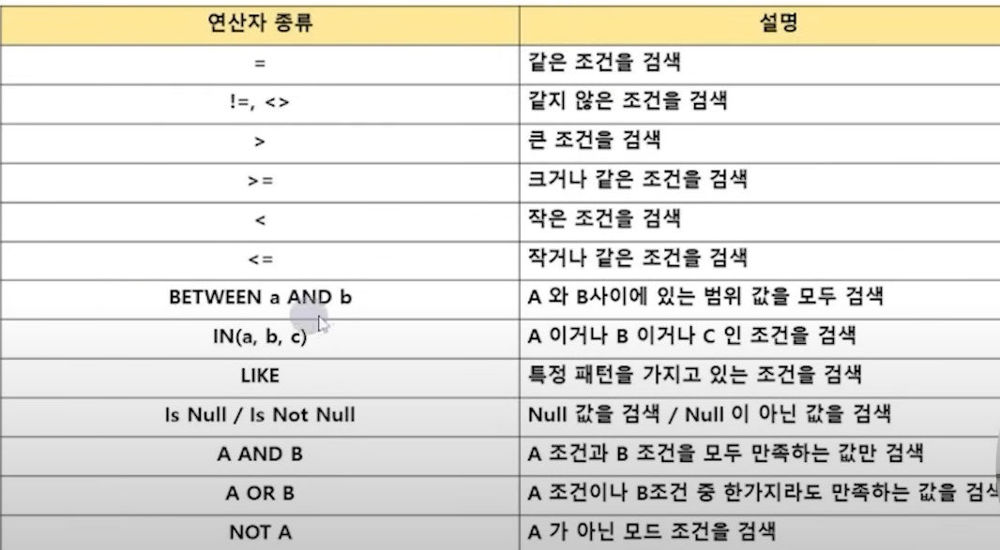

#### GROUP BY 절
- 각 행을 특정 조건에 따라 그룹으로 분리하여 계산하도록 하는 구문식
- GROUP BY절에 그룹을 지정할 컬럼을 전달(여러 개 전달 가능)
- 만약 그룹 연산에서 제외할 대상이 있다면 미리 WHERE절에서 해당 행을 제외함(WHERE절이 GROUP BY절보다 먼저 수행되므로)
- 그룹에 대한 조건은 WHERE절에서 사용할 수 없음
- SELECT 절에 집계 함수를 사용하여 그룹연산 결과 표현
- GROUP BY절을 사용하면 데이터가 요약되므로 요약되기 전 데이터와 함께 출력할 수 없음
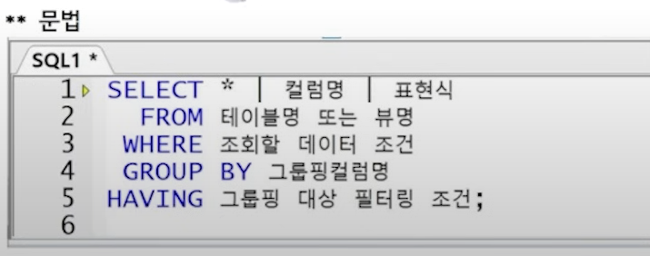

#### HAVING 절
- 그룹 함수 결과를 조건으로 사용할 대 사용하는  절
- WHERE 절을 사용하여 그룹을 제한할 수 없으므로 HAVING 절에 전달
- HAVING 절이 GROUP BY 절 앞에 올 수는 있지만 뒤에 쓰는 것을 권장
- 내부적 연선 순서가 SELECT 절보다 먼저이므로 SELECT절에서 선언된 Alias 사용 불가

WHERE절에도 사용할 수 있는 조건절이면 HAVING절보단 WHERE절에서 사용하는 것이 좋음

#### ORDER BY 절
- 데이터는 입력된 순서대로 출력되나, 출력되는 행의 순서를 사용자가 변경하고자 할 때 ORDER BY 절을 사용
- ORDER BY 뒤에 명시된 컬럼 순서대로 정렬 -> 1차 정렬, 2차 정렬 전달 가능
- 정렬 순서를 오름차순(ASC), 내림차순(DESC)으로 전달(생략 시 오름차순 정렬)
- 유일하게 SELECT 절에 정의한 컬럼 별칭 사용 가능
- SELECT 절에 선언된 순서대로의 숫자로도 사용 가능
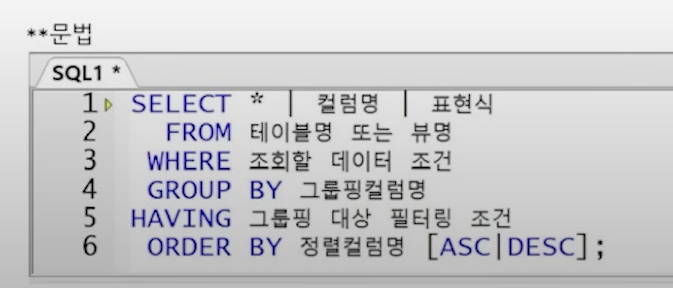

#### 복합 정렬
- 먼저 정렬한 값의 동일한 결과가 있을 경우 추가적으로 정렬 가능
- 1차 정렬한 값이 같은 경우 그 값 안에서 2차 정렬 컬럼값의 정렬이 일어남
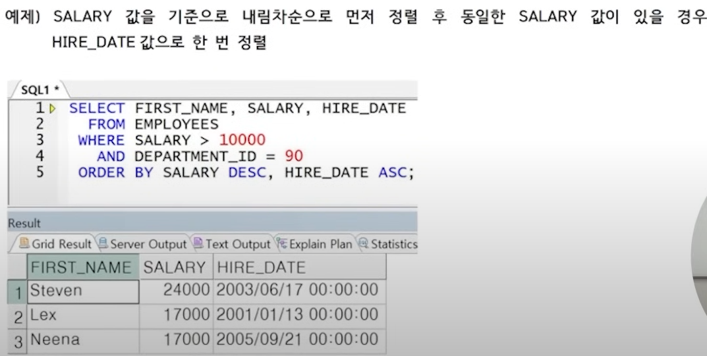

### JOIN(조인)
- 여러 테이블의 데이터를 사용하여 동시 출력하거나 참조 할 경우 사용
- FROM 절에 조인할 테이블 나열
- ORACLE 절에 조인할 테이블 나열
- WHERE 절에서 조인 조건을 작성
- 동일한 열 이름이 여러 테이블에 존재할 경우 열 이름 앞에 테이블 이름이나 테이블 Alias 붙임
- N개의 테이블을 조인하려면 최소 N-1개의 조인 조건이 필요
- ORACLE 표준과 ANSI 표준이 서로 다름

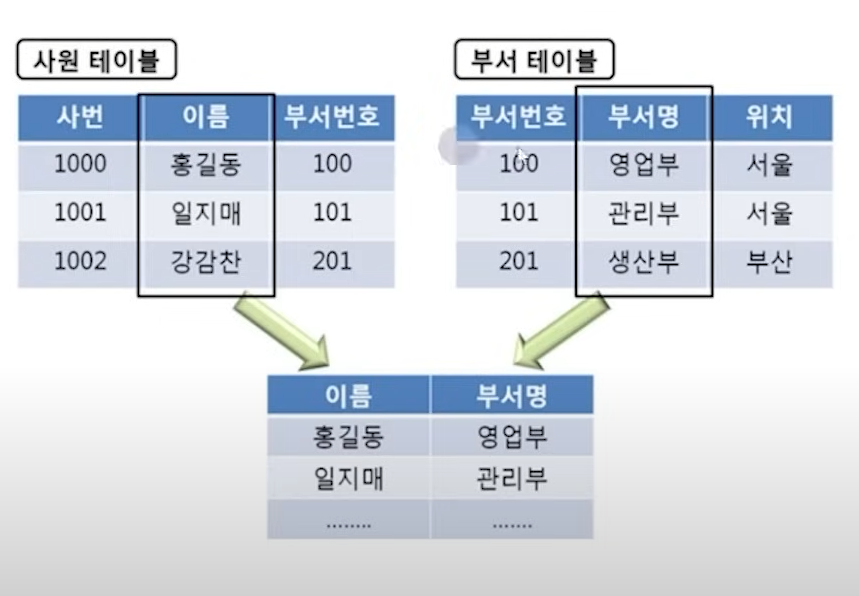

#### 조인 종류
1. 조건의 형태에 따라
   - EQUI JOIN(등가 조인) : JOIN 조건이 동등 조건인 경우
   - NON EQUI JOIN : JOIN 조건이 동등 조건이 아닌 경우
2. 조인 결과에 따라
   - INNER JOIN : JOIN 조건에 성립하는 데이터만 출력하는 경우
   - OUTER JOIN : JOIN 조건에 성립하지 않는 데이터도 출력하는 경우

   (LEFT/RIGHT/FULL OUTER JOIN으로 나뉨)
3. NATURAL JOIN : 조인조건 생략 시 두 테이블에 같은 이름으로 자연 연결되는 조인
4. CROSS JOIN : 조인조건 생략 시 두 테이블의 발생 가능한 모든 행을 출력하는 조인
5. SELF JOIN : 하나의 테이블을 두 번 이상 참조하여 연결하는 조인

#### ON 절
- 조인할 양 컬럼의 컬럼명이 서로 다르더라도 사용 가능
- ON 조건의 괄호는 옵션(생략 가능)
- 컬럼명이 같을 경우 테이블 이름이나 별칭을 사용하여 명확하게 지정(테이블 출처 명확히)
- ON 조건절에서 조인조건 명시, WHERE 절에서는 일반조건 명시
- WHERE 절과 ON 절을 쓰임에 따라 명확히 구분
