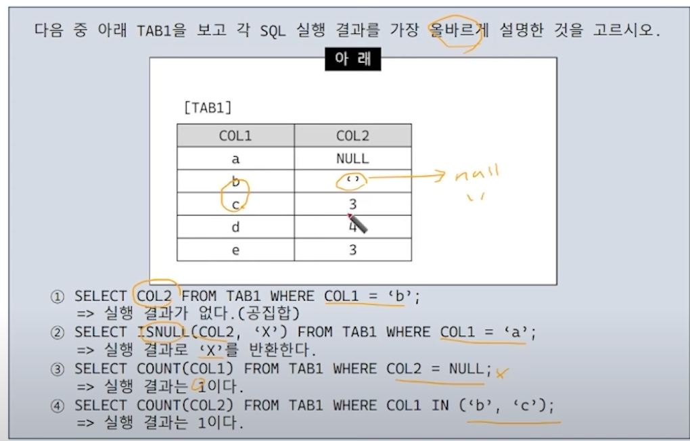
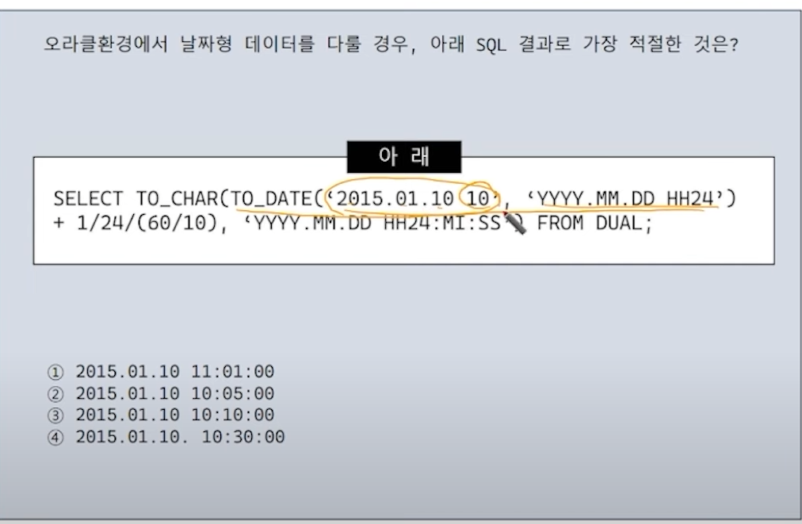
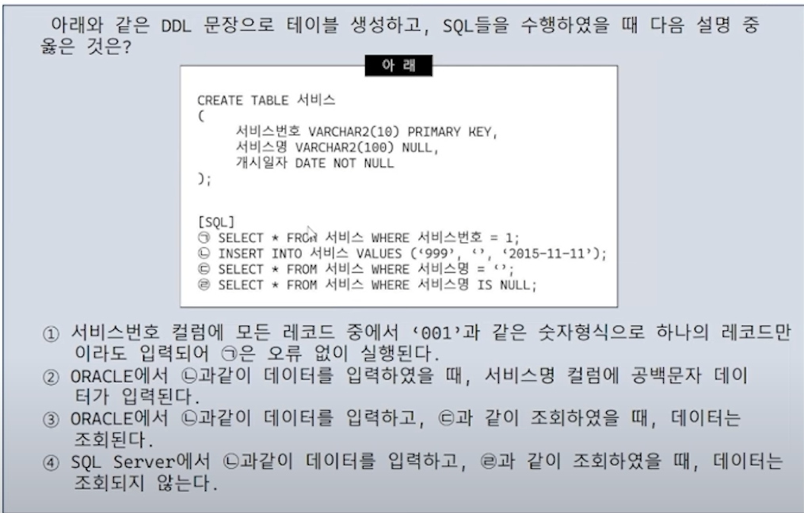
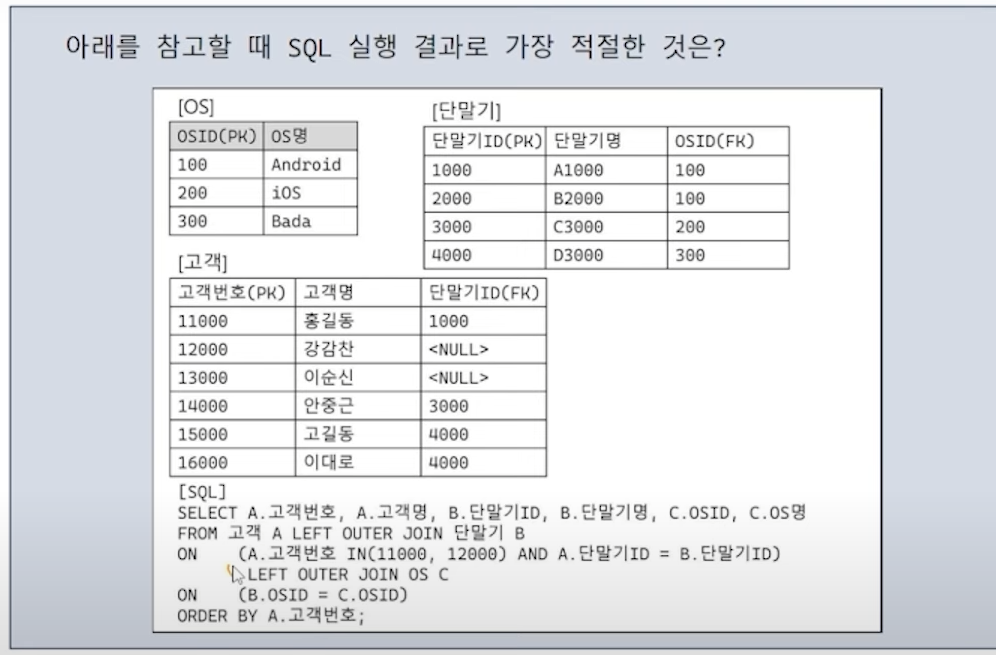
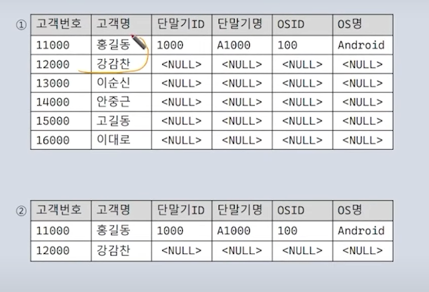
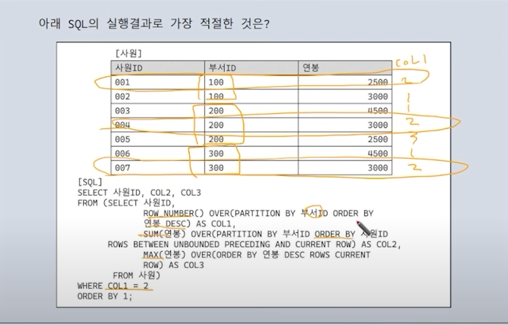
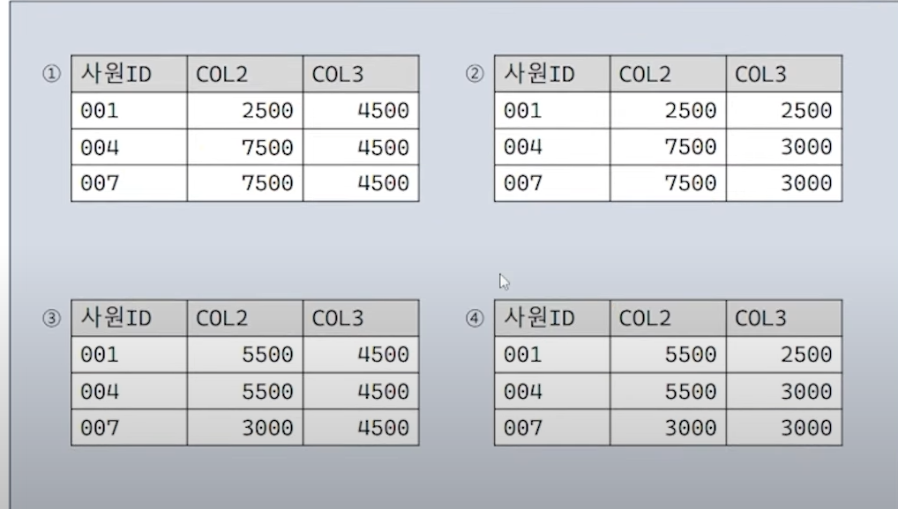
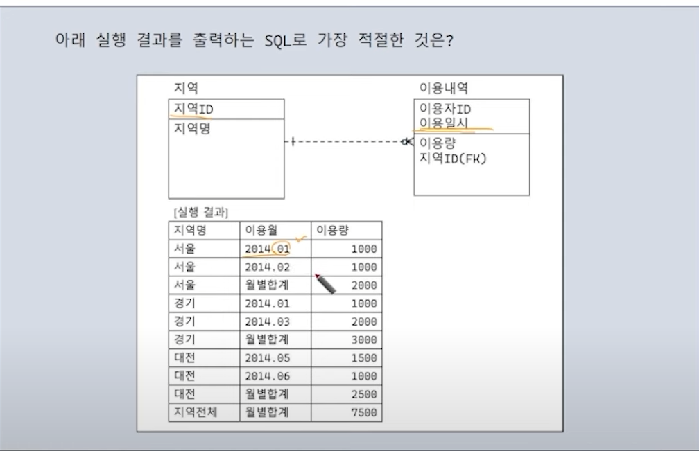
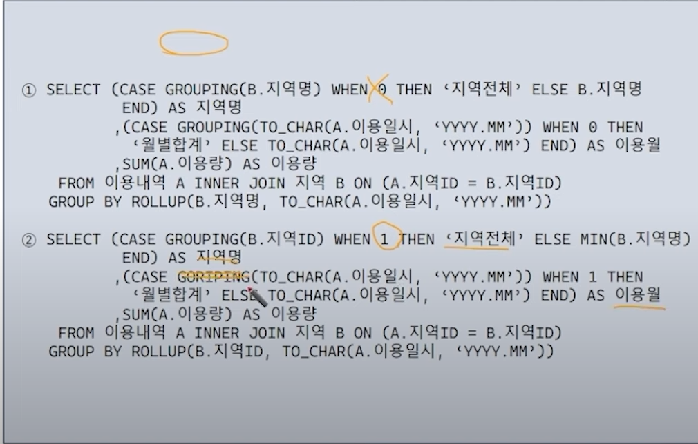

출처 : https://www.youtube.com/watch?v=5fTVqNUE5sg

정답 : 2번

해설 : ISNULL을 통해 NULL 값일 경우 X로 치환햇다.
3번과 헷갈린 이유는 COL2 = NULL 이라는 연산이 WHERE 절에서 성립되지 않음을 몰랐다.

정답 : 3

해설 : 날짜 연산에 대한 문제이다. 먼저 TO_DATE를 보면 2015.01.10 10을 날짜 연산으로 치환하는 연산이다.
거기에 1일 / 24 -> 1시간 -> 6으로 나눔 -> 10분 을 더해 YYY.MM.DD HH24:MI:SS 형식으로 출력하라는 뜻이다.
따라서 2015.01.10 10:10이 정답이다.

정답 : 4

해설 : ORACLE의 경우 빈 문자열을 NULL로 입력한다. 따라서 2번과 3번은 정답이 아니다. 반면 SQL Server는 빈문자열을 빈문자열로 저장한다.

정답 : 1

해설 
- LEFT OUTER JOIN : 고객에 대해 단말기가 없더라도 채움
- ON절 -> WHERE절이었으면 해당 부분만 출력했지만 ON절은 전체 출력한다. 단 ON절 안에 있는 범위에만 JOIN문을 실행한다.
- 따라서 위 문제에서는 ON 절을 제외하고는 NULL로 채워서 이어붙여서 출력한다.
- 1번을 보면 단말기 ID가 없더라도 LEFT OUTER JOIN에 의해 NULL로 연결되었고 나머지 역시 NULL로 연결된 모습니다.

정답 : 2

해설 
- ROW NUMBER : 같은 값들끼리 크기를 비교하는 구문
- ROWS 아래 구문은 행 별로 누적합을 구하라는 뜻 : 모르는 구문이 나왔을 때 상식선에서 생각

정답 : 2

해설
- 지역 + 이용월을 사용해 두 테이블을 조인해야 한다.
- 마지막에 지역 전체가 나오므로 ROLLUP을 사용한다.
- ROLLUP(A,B) -> A별, B별, 전체로 결과가 나옴
- 이용월이 1일 때 월별합계로 치환