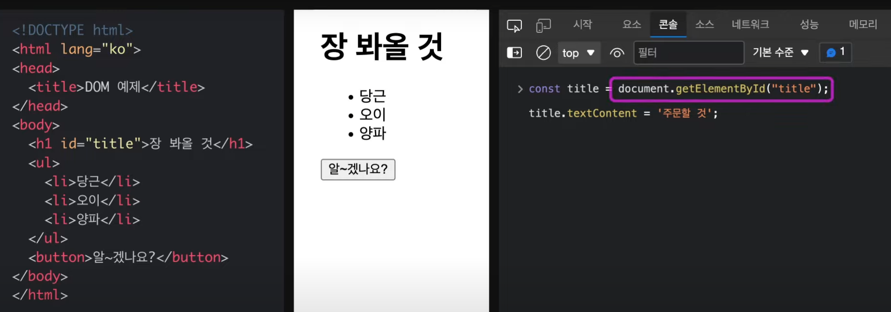
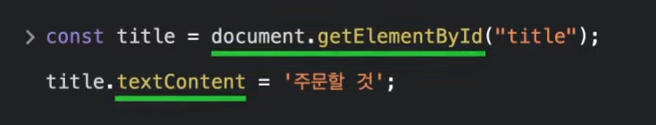
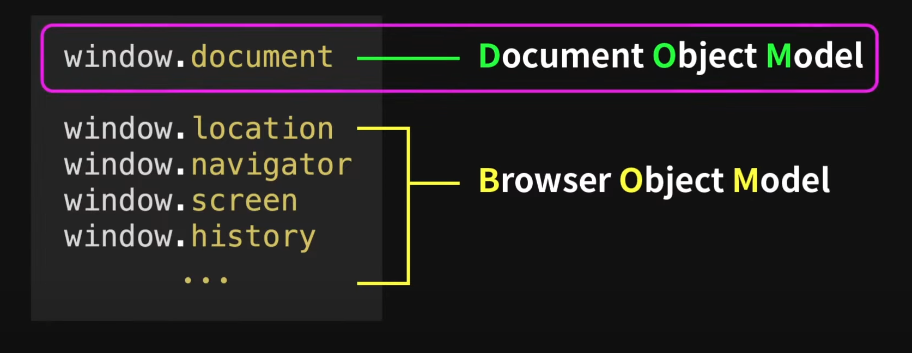
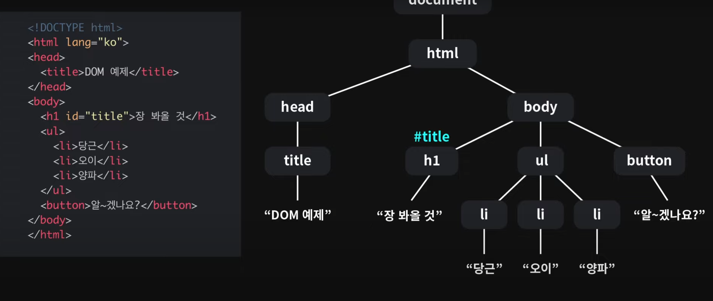
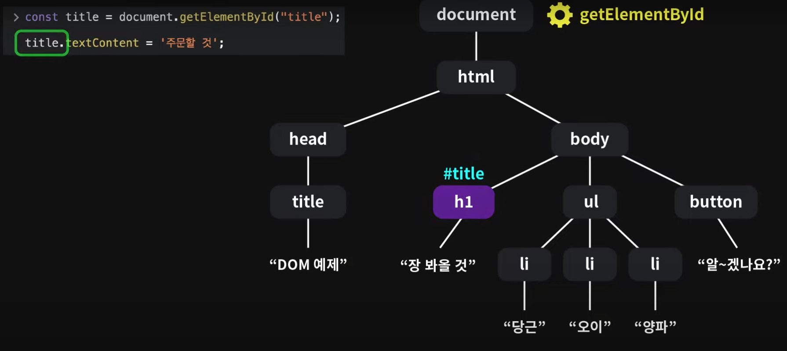
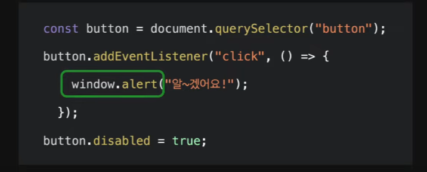
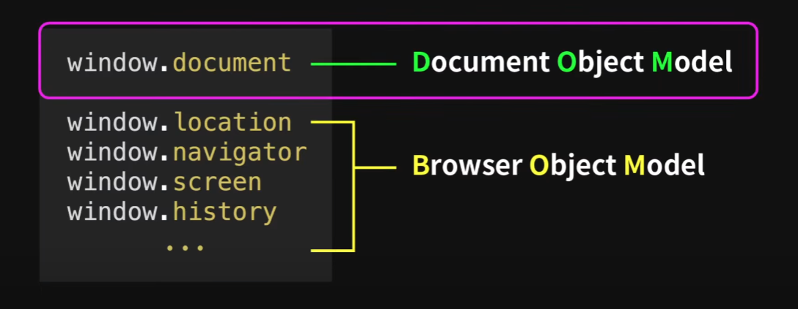

출처 : https://www.youtube.com/watch?v=mFawNZz_Uu0
## DOM
- 웹페이지에서 자바스크립트로 요소들을 제어하는데 사용되는 Document Object Model

### 예제

- 위의 HTML 문서를 자바스크립트 코드를 활용해 변경해본다.
- document의 getElementById를 이용해 id 값을 가져와 textContent 메서드를 활용해 텍스트를 바꿔준다.

이때 밑 줄친 부분은 자바스크립트 요소가 아니다.

먼저 document를 예시로 들면 document는 브라우저에서는 사용할 수 있지만 node.js와 같이 컴퓨터 자체에서 JavaScript를 실행하는 환경에서 실행해보면 document를 찾을 수 없다.

이처럼 document 객체가 브라우저에서만 접근되는 이유는 document가 JavaScript 객체가 아닌, 브라우저에서 제공하는 window 객체의 한 요소이기 때문이다.

그리고 이와 같은 window.document 객체를 DOM이라 분류한다.

### DOM에 대해 알아보기
- 우리가 웹 사이트에 접근하면 브라우저가 HTML 문서를 읽어들인다.
- 브라우저가 HTML 문서를 읽어들이면 DOM이 생성된다.(오른쪽 그림)

DOM은 해당 트리 전체를 말하며 구성하는 요소들은 Node로 분류한다.

JavaScript로 웹 페이지의 요소들을 제어할 수 있는 이유는 DOM이 API이기 때문이다.

### DOM의 역할

DOM 요소들의 고유 기능과 상속 관계를 알면 각각에서 무엇을 사용하는지 파악할 수 있다.

### BOM

window 부분의 코드를 보면 alert는 JavaScript 객체가 아니면서도 DOM에 속하지 않는다.

- 브라우저는 DOM을 제외하고도 사용하자 브라우저에서 일어나는 일을 제어할 수 있도록 BOM이라는 걸 제공한다.
- BOM은 다른 웹페이지로 이동하거나 화면 관련 정보를 얻거나 브라우저의 알림창을 보내거나 AJAX 요청을 보내는 등 많은 기능이 있다.

브라우저에서 제공하는 이 모든 것들을 통틀어서 WEB API라고 한다.

WEB API는 JavaScript 기능은 아니지만 자바스크립트 등을 통해 제어될 수 있도록 브라우저에서 제공하고 있다.

