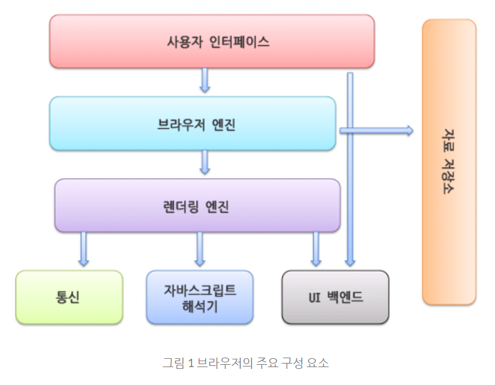
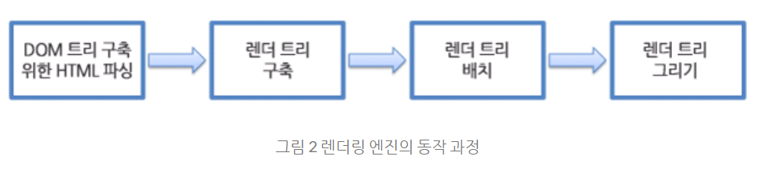
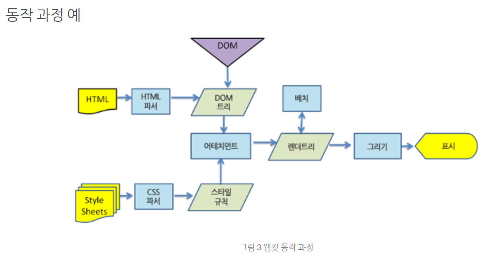
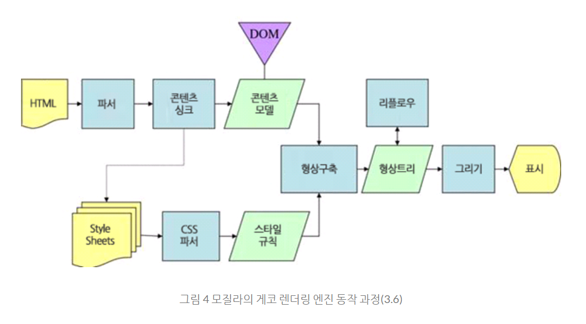

학습자료 : https://d2.naver.com/helloworld/59361,  https://www.youtube.com/watch?v=Mqh13dNI8jc

# 학습 목표
- 브라우저의 동작과정을 이해하고 naver.com을 입력했을 때 어떤 과정을 거쳐 네이버 페이지가 화면에 보이게 되는지 이해하기

## 브라우저란?
- 월드 와이드 웹(www)의 정보에 접근하기 위해 사용되는 소프트웨어 응용 프로그램
- 사용자는 이를 통해 웹 페이지를 보고 하이퍼링크를 따라 이동하며 다양한 웹 기반 서비스 및 콘텐츠와 상호 작용할 수 있음
- 브라우저는 HTML 문서를 해석하고 CSS 및 JavaScript와 같은 다른 웹 기술과 함께 작동하여 웹 페이지를 사용자에게 시각적으로 표시함

월드 와이드 웹이란? : 
## 브라우저의 주요 기능
- 브라우저의 주요 기능 : 사용자가 선택한 자원을 서버에 요청하고 브라우저에 표시하기
- 자원의 주소는 URI(Uniform Resource Identifier)에 의해 정해짐

## 브라우저의 기본 구조
1. 사용자 인터페이스 - 주소 표시줄, 이전/다음 버튼, 북마크 메뉴 등 요청한 페이지를 보여주는 창을 제외한 나머지 모든 부분
2. 브라우저 엔진 - 사용자 인터페이스와 렌더링 엔진 사이의 동작을 제어
3. 렌더링 엔진 - 요청한 콘텐츠를 표시, 예를 들어 HTML을 요청하면 HTML과 CSS를 파싱하여 화면에 표시함
4. 통신 - HTTP 요청과 같은 네트워크 호출에 사용됨. 이것은 플랫폼 독립적인 인터페이스이고 각 플랫폼 하부에서 실행됨
5. UI 백엔드 - 콤보 박스와 창 같은 기본적인 장치를 그림. 플랫폼에서 명시하지 않은 일반적인 인터페이스로서, OS 사용자 인터페이스 체계를 사용
6. 자바스크립트 해석기 - 자바스크립트 코드를 해석하고 실행
7. 자료 저장소 - 이 부분은 자료를 저장하는 계층이다. 쿠키를 저장하는 것과 같이 모든 종류의 자원을 하드 디스크에 저장할 필요가 있다. HTML5 명세에는 브라우저가 지원하는 웹 데이터베이스가 정의되어있다.

크롬은 대부분의 브라우저와 달리 각 탭마다 별도의 렌더링 엔진 인스턴스를 유지한다.

각 탭은 독립된 프로세스로 처리된다.

### 렌더링 엔진
- 렌더링 엔진은 요청 받은 내용을 브라우저 화면에 표시한다.
- 렌더링 엔진은 HTML 및 XML 문서와 이미지를 표시할 수 있다. 물론 플러그인이나 브라우저 확장 기능을 이용해 PDF와 같은 다른 유형도 표시할 수 있다.

#### 렌더링 엔진의 동작과정
- 렌더링 엔진은 통신으로부터 요청한 문서의 내용을 얻는 것으로 시작하는데 문서의 내용은 보통 8KB 단위로 전송됨

1. 렌더링 엔진은 HTML 문서를 파싱하고 콘텐츠 트리 내부에서 태그를 DOM 노드로 변환한다. 그 다음 외부 CSS 파일과 함께 포함된 스타일 요소도 파싱한다.스타일 정보와 HTML 표시 규칙은 렌더 트리라고 부르는 또 다른 트리를 생성한다.
2. 랜더 트리는 색상 또는 면적과 같은 시각적 속성이 있는 사각형을 포함하고 있는데 정해진 순서대로 화면에 표시된다.
3. 랜더 트리 생성이 끝나면 배치가 시작되는데 이것은 각 노드가 회면의 정확한 위치에 표시되는 것을 의미한다.
4. 다음으로 UI 백엔드에서 렌더 트리의 각 노드를 가로지르며 현상을 만들어 내는 그리기 과정이다.

일련의 과정들은 점진적으로 진행된다. 렌더링 엔진은 빠르게 내용을 표시하기 위해 모든 HTML을 파싱할 때까지 기다리지 않고 배치와 그리기 과정을 시작한다.
네트워크로부터 나머지 내용이 전송되기를  기다리는 동시에 받은 내용의 일부를 먼저 화면에 표시하는 것이다.

웹킷(사파리, 크롬의 렌더링 엔진), 게코(파이어폭스의 렌더링 엔진)가 용어를 약간 다르게 사용하고 있지만 동작 과정은 기본적으로 동일하다.

## 파싱과 DOM 트리 구축
