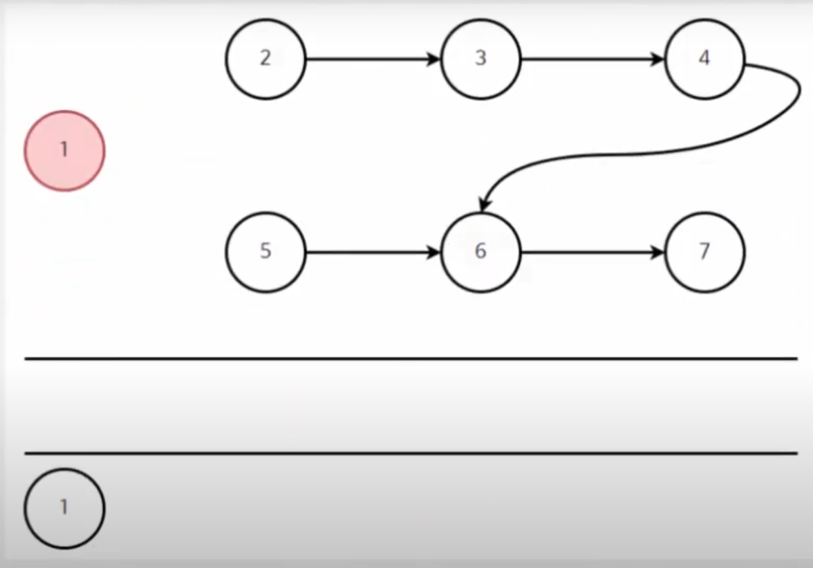

출처 : 유튜브 동빈나 알고리즘
## 위상 정렬

위상정렬(Topology Sort)은 순서가 정해져 있는 작업을 차례로 수행해야 할 때 그 순서를 결정해주기 위해
사용하는 알고리즘입니다.

순서가 정해져 있는 작업의 대표적인 예시는 다음과 같습니다.


그래프의 흐름은 사실 '조건'으로 해석할 수 있습니다. 일반적으로 정보처리기사를
취득하기 위해서는 '4학년 되기'를 만족해야 하고, 4학년이 되기 위해서는 그 전에
'대학생 되기'를 만족해야 합니다.
이렇게 작업의 순서가 정해져 있을 때 작업을 정확하게 정렬해주는 알고리즘이 필요할 수 있습니다.
위와 같이 여러 개의 순서가 정해져있을 때 조건에 부합하는 일직선의 순서를 찾아봅시다.

위상 정렬 : 대학생 되기 -> 학과 사이트 가입하기 -> 4학년 되기 -. 정보처리기사 합격하기 -> 
자격증 서류 제출하기 -> 졸업시험 신청하기 -> 졸업하기

위와 같이 정렬을 하면 순서대로 작업을 수행했을 때 성공적으로 졸업하기 까지 갈 수 있습니다.

또한 위의 답 뿐만아니라 위상정렬은 여러 개의 답을 가질 수 있습니다.


그리고 위상 정렬은 DAG(Direted Acyclic Graph)에만 적용이 가능합니다.
이것은 사이클이 발생하지 않는 방향 그래프라는 의미입니다.

사이클이 발생하는 경우 위상 정렬을 수행할 수 없습니다.


위와 같은 그래프에서는 위상 정렬을 사용할 수 없다. 

위상정렬은 시작점이 존재해야 하는데 위와 같은 사이클 그래프에서는 시작점부터 찾을 수가 없다.


그럼 맨 처음 그래프를 다시 보자.

위상 정렬 알고리즘은 두 가지 해결책을 낸다는 특징이 있습니다.
1. 현재 그래프는 위상 정렬이 가능한지
2. 위상 정렬이 가능하다면 그 결과는 무엇인지

위상 정렬은 dfs나 bfs로 구현되는데 보통은 bfs로 구현한다.


bfs를 활용해 위상 정렬을 만드는 방법은 다음과 같다.
1. 진입 차수가 0인 정점을 큐에 삽입합니다.
2. 큐에서 원소를 꺼내 연결된 모든 간선을 제거합니다.
3. 간선 제거 이후에 진입차수가 0이 된 정점을 큐에 삽입합니다.
4. 큐가 빌 때까지 2번~3번 과정을 반복합니다. 모든 원소를 방문하기 전에 큐가 빈다면 사이클이 존재하는 것이고, 모든 원소를 방문했다면 큐에서 꺼낸 순서가 위상 정렬의 결과입니다.ㅣ

위의 그래프에 위상 정렬을 적용했을 경우


진입 차수가 0인 정점 1을 큐에 삽입합니다.

1을 큐에서 빼낸 뒤에 연결되어있던 간선을 다 제거해주었습니다. 

위와 같은 작업을 반복하여 큐가 빌 때까지 진행합니다.

자바로 구현한 위상 정렬
```
import java.io.BufferedWriter;
import java.io.IOException;
import java.io.OutputStreamWriter;
import java.util.ArrayList;
import java.util.LinkedList;
import java.util.List;
import java.util.Queue;

public class Study_topologicalSort {

    public static void main(String[] args) throws IOException {

        // 위상정렬 결과를 출력할 객체
        BufferedWriter bw = new BufferedWriter(new OutputStreamWriter(System.out));

        // 위상정렬에 사용할 진입차수 저장 배열
        // 길이가 9인 이유는 인덱스를 1부터 사용하기 위해서입니다.
        int[] edgeCount =new int[9];

        // 위상정렬에 사용할 그래프 2차원 리스트로 구현
        ArrayList<ArrayList<Integer>> graph = new ArrayList<ArrayList<Integer>>();
        for (int i = 0; i < 9; i++) {
            graph.add(new ArrayList<Integer>());
        }

        // 그래프 각 노드별 인접한 노드정보 초기화
        graph.get(1).add(2);
        graph.get(1).add(4);
        graph.get(2).add(5);
        graph.get(2).add(6);
        graph.get(3).add(6);
        graph.get(4).add(2);
        graph.get(4).add(8);
        graph.get(7).add(3);
        graph.get(8).add(6);

        // 진입차수 테이블 초기화
        edgeCount[2] = 2;
        edgeCount[3] = 1;
        edgeCount[4] = 1;
        edgeCount[5] = 1;
        edgeCount[6] = 3;
        edgeCount[8] = 1;

        // 위상정렬에 사용할 큐
        Queue<Integer> q = new LinkedList<>();

        // 진입차수가 0인 값 큐에 넣기
        for (int i = 1; i < edgeCount.length; i++) {
            if (edgeCount[i] == 0) {
                q.offer(i);
            }
        }

        // 큐가 빌 때까지 반복
        while (!q.isEmpty()) {
            // 큐에서 노드번호 꺼내기
            int nodeNo = q.poll();

            // 꺼낸 노드번호 정렬 결과값에 저장
            bw.write(String.valueOf(nodeNo) + " ");

            // 꺼낸 노드의 인접한 노드들 찾기
            List<Integer> list = graph.get(nodeNo);

            // 인접한 노드의 개수만큼 반복문 실행
            for (int i = 0; i < list.size(); i++) {
                // 인접한 노드 진입차수 갱신
                edgeCount[list.get(i)] -- ;
                // 갱신된 노드의 진입차수가 0이면 큐에 노드 넣기
                if (edgeCount[list.get(i)] == 0) {
                    q.offer(list.get(i));
                }
            }
        }

        // 위상정렬 수행 결과 값 출력
        bw.flush();
    }
}


```
위상 정렬의 시간 복잡도는 O(V+E)입니다. 즉 정점의 갯수 + 간선의 갯수만큼 소요되므로 매우 빠른 알고리즘 중 하나 입니다.


